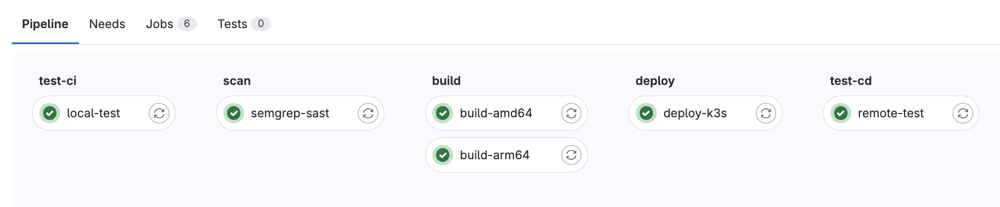
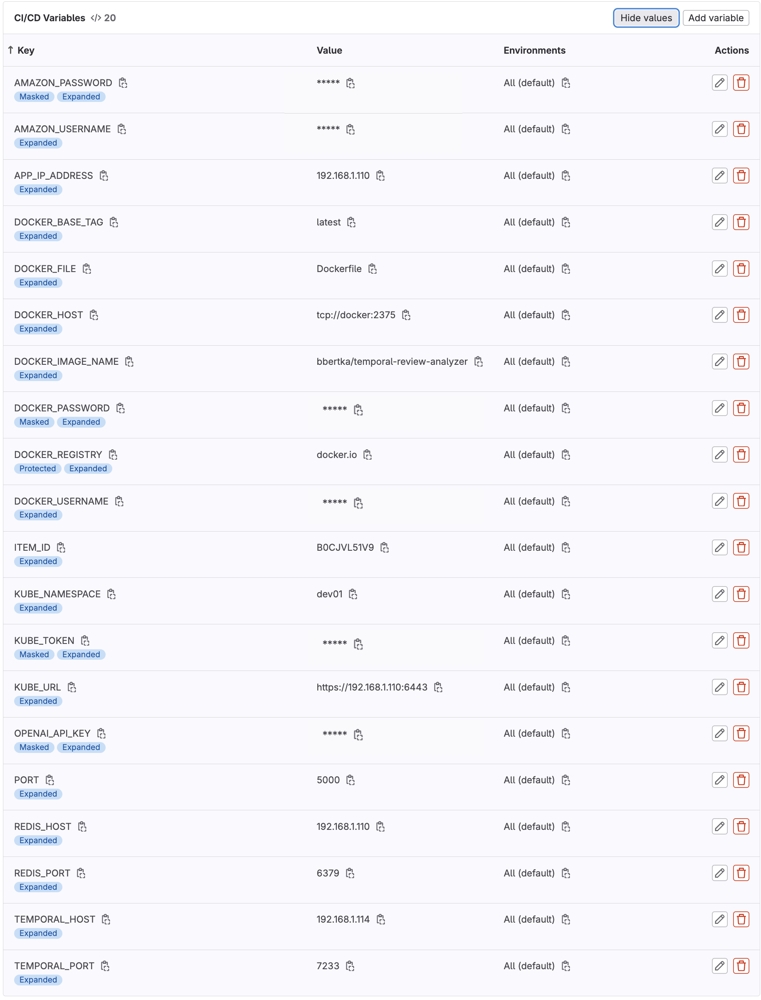

# OpenAI GPT Review Analyzer 

This project integrates OpenAI's ChatGPT for foundational natural language processing tasks. It explores a microservices architecture, utilizing Python's programming flexibility alongside Flask's HTTP request management. The system incorporates Temporal for workflow management and Redis for data storage, establishing a scalable framework for data processing. This MVP is designed to process and analyze Amazon review datasets on a manageable scale, aiming to provide basic sentiment analysis and insights.  

- For more deep dive into the application itself, follow this link [THEORY.md](docs/THEORY.md)

- To jump straight to the GitLab Pipeline overview, follow this link [PIPELINE.md](docs/PIPELINE.md)

## Implementation Overview

- **Flask Application (`routes.py`)**: Serves as the entry point for the application, handling HTTP requests and triggering Temporal workflows.
- **Temporal Workflow (`main.py`)**: Orchestrates the review scraping and analysis tasks, ensuring reliable execution and fault tolerance.
- **Scraper Activity (`scrape.py`)**: Scrapes review data from Amazon product pages and stores it in Redis.
- **Analysis Activity (`analyze.py`)**: Analyzes the scraped review data using both TextBlob and OpenAI's GPT model to determine overall sentiment.
- **Configuration (`config.py`)**: Manages environment variables and application configuration settings, including the OpenAI API key.
- **Redis** Acts as a temporary data store for the scraped reviews, facilitating distributed processing.

### Key Features

- Scalable review scraping and analysis.
- Fault-tolerant workflow execution with Temporal.
- Simple HTTP interface for triggering analysis jobs.
- Configurable for different Amazon products.

## Getting Started

### Prerequisites

- Access to OpenAI API with a valid API key.
- Temporal Server
- Redis instance
- Kubernetes
- GitLab 

---
## GitLab Pipeline


## Setting Up in GitLab

To run this project in a GitLab environment, follow these steps to import the repository into GitLab and set up the necessary CI/CD environment variables.

### Importing the Repository into GitLab

1. **Go to GitLab**: Log in to your GitLab account.
2. **New Project**: Navigate to the **New project** page.
3. **Import Project**: Click on **Import project** tab.
4. **Repo by URL**: Choose **Repo by URL**, and fill in the form with the GitHub repository URL.
    - **Git repository URL**: `https://github.com/yourusername/openai-gpt-review-analyzer.git` (Replace with your GitHub repo URL)
    - **Project name**: Ideally the same as your GitHub repository.
    - **Visibility Level**: Choose according to your preference.
5. **Begin Import**: Click on **Create project** to start the import process.

### Configuring CI/CD Environment Variables

After importing your project, you need to configure the CI/CD environment variables to match the project's requirements. A Detailed breakdopwn of the variables and what they are used for are here [PIPELINE.md](docs/PIPELINE.md)

1. **Navigate to CI/CD Settings**:
    - Go to your project's homepage in GitLab.
    - Select **Settings** > **CI / CD**.
    - Expand the **Variables** section.

2. **Add Variables**:
    - Click on **Add Variable** for each of the following variables you need to set. Here is a list of common variables used in CI/CD pipelines (replace these with the actual variables you need for your project):
        - `DOCKER_USERNAME`: Your DockerHub username.
        - `DOCKER_PASSWORD`: Your DockerHub password or access token.
        - `DOCKER_REGISTRY`: The Docker registry URL, e.g., `docker.io`.
        - `DOCKER_IMAGE_NAME`: The name of the Docker image you wish to build and push.
    - Input the **Key** and **Value** for each variable.
    - Choose the **Type** as `Variable`.
    - Select the **Mask variable** option if it's sensitive information like passwords.
    - Click **Add Variable** to save each one.

3. **Refer to the Provided Screenshot for Reference**:
    - To ensure you have all the necessary environment variables configured, please refer to the screenshot:



#### Pod Variables after CI/CD Config

Here are the following results of Docker/Pod env variables for the deployed application.  Notice the secrets that are in place from the pipeline.

```bash
$ kubectl get deployment temporal-review-analyzer-deployment -n dev01 -o yaml | yq '.spec.template.spec.containers[].env'
[
  {
    "name": "TEMPORAL_HOST",
    "value": "192.168.1.114"
  },
  {
    "name": "TEMPORAL_PORT",
    "value": "7233"
  },
  {
    "name": "REDIS_HOST",
    "value": "192.168.1.110"
  },
  {
    "name": "REDIS_PORT",
    "value": "6379"
  },
  {
    "name": "REDIS_DB"
    "value": "0"
  },  
  {
    "name": "PORT",
    "value": "5000"
  },
  {
    "name": "OPENAI_API_KEY",
    "valueFrom": {
      "secretKeyRef": {
        "key": "OPENAI_API_KEY",
        "name": "openai-api-key-secret"
      }
    }
  },
  {
    "name": "AMAZON_USERNAME",
    "valueFrom": {
      "secretKeyRef": {
        "key": "AMAZON_USERNAME",
        "name": "amazon-username-secret"
      }
    }
  },
  {
    "name": "AMAZON_PASSWORD",
    "valueFrom": {
      "secretKeyRef": {
        "key": "AMAZON_PASSWORD",
        "name": "amazon-password-secret"
      }
    }
  }
]
```

### Running CI/CD Pipeline

With the repository imported and environment variables configured, your CI/CD pipeline is now ready to run. Trigger a pipeline by:

- Making a new commit to your repository.
- Manually running the pipeline from **CI/CD** > **Pipelines** in your GitLab project.

### Overview of Kubernetes Deployment:

- Secrets Creation: The deploy job creates Kubernetes secrets for AMAZON_PASSWORD and OPENAI_API_KEY by encoding these variables to base64 and applying them to the cluster. This ensures that sensitive information is securely stored and accessible to the deployment.
- Deployment Application: The job then uses envsubst to substitute placeholders in deployment.yml with environment variable values defined in GitLab CI/CD settings. This allows placeholders in this deployment.yml to be replaced.
- Deployment and Rollout: After applying the deployment configuration, the job triggers a rollout restart to ensure the new configuration is used by the deployed pods.
---

## Testing Guide

This guide provides instructions on how to run automated tests for the Temporal Review Analyzer application. The tests are designed to send HTTP requests to the application for a list of predefined Amazon product IDs to analyze sentiment.

### Prerequisites

Before running the tests, ensure you have the following:

- The Temporal Review Analyzer application is running and accessible.
- `curl` installed on your system for sending HTTP requests.
- `jq` utility installed on your system for URL encoding of query parameters.

### Test Files

- **`items1.txt`**: Contains a list of Amazon product IDs to be analyzed.
- **`test1.sh`**: A shell script that reads `items1.txt` and sends HTTP requests to the application for each product ID.

### Running the Tests

1. Ensure the Temporal Review Analyzer application is running and accessible at the specified URL within the `test1.sh` script.
2. Open a terminal and navigate to the directory containing `test1.sh` and `items1.txt`.
3. Make `test1.sh` executable by running:

```bash
chmod +x test1.sh
```

4. Execute the test script:

```bash
./test1.sh
```

The script will read each Amazon product ID from `items1.txt`, URL encode the product ID, and send an HTTP GET request to the application. The application's response, including the sentiment analysis result for each product, will be printed to the terminal.

```bash
(env) Bens-MacBook-Pro:temporal-review-analyzer bbertka$ ./test1.sh
{"item":"B0CJVL51V9","result":82.664,"verdict":"B-"}
{"item":"B07CJV9H25","result":92.67128712871293,"verdict":"A-"}
{"item":"B0CL38TZ3L","result":68.2,"verdict":"D+"}
{"item":"B0CF1VZ5H4","result":70.65714285714286,"verdict":"C-"}
{"item":"B0CF1ZVLKS","result":80.84444444444445,"verdict":"B-"}
{"item":"B0CF1TFM39","result":79.10000000000001,"verdict":"C+"}
{"item":"B0CVX5RTZJ","result":0.0,"verdict":"F"}
{"item":"B0BN1K7ZLZ","result":58.228571428571435,"verdict":"F"}
{"item":"B0CR8KY6G5","result":0.0,"verdict":"F"}
{"item":"B0B6148YKN","result":92.580198019802,"verdict":"A-"}
{"item":"B09WB2NL8W","result":90.98019801980203,"verdict":"A-"}
{"item":"B07BPKL2D2","result":92.53267326732676,"verdict":"A-"}
{"item":"B07Q5HMXTN","result":86.52277227722779,"verdict":"B"}
```

