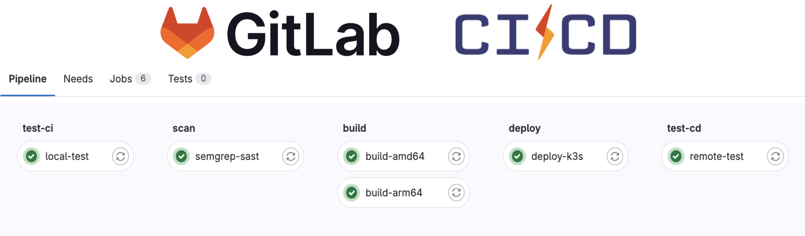

# Gitlab Pipeline Overview

Take a look at the GITLAB Pipeline here [.gitlab-ci.yml](../.gitlab-ci.yml)

All variables are set within GitLab's CI/CD Variable space for the project.  Note that the Dockerfile, K3's deployment.yml, and .gitlab-ci.yml all work togeher.  The Dockerfile has stubs that are populated by the deployment, which is pupulated by the pipeline.  Here is a breakdown of the deployment and pipeline.

## Kubernetes Deployment

The `deployment.yml` file leverages templating to inject environment-specific variables into the Kubernetes deployment at runtime. This approach allows for a flexible deployment that can adapt to different environments (development, staging, production) without changing the core manifest file.

### Container Environment Variables

- **${TEMPORAL_HOST}**: This template variable is used to set the `TEMPORAL_HOST` environment variable within the container, dictating where the application connects to access the Temporal workflow service.
- **${TEMPORAL_PORT}**: Corresponds to the `TEMPORAL_PORT` environment variable inside the container, defining the port for the Temporal service communication.
- **${REDIS_HOST}**: Sets the `REDIS_HOST` environment variable, pointing to the Redis service host for caching functionalities.
- **${REDIS_PORT}**: Defines the `REDIS_PORT` environment variable, indicating the port on which the Redis service is listening.
- **${REDIS_DB}**: Used to specify the `REDIS_DB` environment variable, selecting the database index for Redis.
- **${PORT}**: Represents the `PORT` environment variable, denoting the port number on which the application container is set to listen for incoming traffic.

### Secrets and Sensitive Data

Sensitive information is not hardcoded but rather referenced through Kubernetes secrets to enhance security.  The variables are input into the GitLab Ci/CD GUI before securely cascading into the deployment.

- **OPENAI_API_KEY**: Instead of a direct value, a reference to a Kubernetes secret `openai-api-key-secret` is made to set the `OPENAI_API_KEY` environment variable. This secret holds the actual API key needed for OpenAI services.
- **AMAZON_USERNAME** and **AMAZON_PASSWORD**: These are set through references to their respective Kubernetes secrets (`amazon-username-secret` and `amazon-password-secret`), which store the Amazon credentials.

### Service Configuration

- The Kubernetes service definition includes a `port` specification that aligns with the `${PORT}` variable to ensure that the service listens on the correct port as defined by the deployment process.

During the CI/CD pipeline execution, the templated variables (denoted by `${}`) in `deployment.yml` are substituted with the actual values provided either as GitLab CI/CD pipeline variables. This templating is deployment stage of the pipeline, ensuring that each deployment is correctly configured for the target environment.

## GitLab Pipeline

The `.gitlab-ci.yml` file is the core configuration for the GitLab CI/CD pipeline and dictates how the application is built, tested, and deployed. Below is a detailed explanation of how this configuration file is set up and what each section and variable within it accomplishes.

1. **test-ci**: This stage runs automated tests to ensure that the code changes meet the quality standards and do not break existing functionalities.
2. **scan**: Conducts a security scan on the codebase to identify and rectify vulnerabilities.
3. **build**: Responsible for building Docker images for the application that will be pushed to a Docker registry.
4. **deploy**: Handles the deployment of the application to a Kubernetes cluster using the deployment configuration defined in the `deployment.yml`.
5. **test-cd**: Performs tests on the deployed application to ensure it operates correctly in the live environment.

### CI/CD Pipeline Variables

- **DOCKER_HOST**: The URL or IP address and port of the Docker daemon. This variable is particularly important for jobs that need to build or push Docker images, as it tells the GitLab runner where to find the Docker daemon.

- **DOCKER_CLI_EXPERIMENTAL**: When set to "enabled", this variable allows the use of Docker CLI’s multi-architecture builds.

- **DOCKER_TLS_CERTDIR**: The path to the directory holding Docker TLS certificates. In this demo, TLS is not being used.

- **DOCKER_PASSWORD**: The password for logging into the Docker registry. 

- **DOCKER_USERNAME**: The username for logging into the Docker registry.

- **DOCKER_REGISTRY**: The URL of the Docker registry where images are stored. If using Docker Hub, this would typically be set to "docker.io".

- **DOCKER_IMAGE_NAME**: The name of the Docker image that will be built and pushed to a Docker registry.

- **DOCKER_BASE_TAG**: The base tag for the Docker images during the build process.

- **DOCKER_FILE**: The path to the Dockerfile within the repository. Allows you to change the project structure should you need to.

- **ITEM_ID**: Amazon product item ID for used in tests.

- **KUBE_NAMESPACE**: The Kubernetes namespace where the resources will be deployed.

- **KUBE_TOKEN**: The authentication token used for interacting with the Kubernetes cluster.

- **KUBE_URL**: The API endpoint for the Kubernetes cluster where the application will be deployed. 

- **OPENAI_API_KEY**: The API key needed for accessing OpenAI's APIs. This key is used by the application for sentiment analysis.

- **PORT**: The port number that the application listens on.

- **SAST_EXCLUDED_PATHS**: Specifies paths to exclude from static application security testing.

- **APP_IP_ADDRESS**: This is the IP address where the application can be accessed, used during the `remote-test` job to check the live application.

### Job Definitions

Each stage consists of multiple jobs, defined by a series of directives:

- **image**: Specifies the Docker image that will be used to run the CI job.
- **services**: Services are used by the job, such as `docker:dind` (Docker-in-Docker) which allows Docker commands to run within the job.
- **before_script**: Commands that are executed before the main script of the job, often used to set up the environment.
- **script**: The main commands that the job will execute, like running tests, building Docker images, or deploying to Kubernetes.
- **only**: Defines the branch names or tag names for which the job will run. In this case, jobs run only on the `main` branch.

### Specific Jobs in the Pipeline

#### Local and Remote Testing Jobs

- **local-test**: Runs tests locally within the CI runner to validate that the application behaves as expected.
- **remote-test**: Executes tests against the deployed application, ensuring the live environment is working properly.

#### Build Jobs

- **build-amd64** and **build-arm64**: Build Docker images for the amd64 and arm64 architectures, respectively, using build arguments like `$DOCKER_IMAGE_NAME` and `$DOCKER_BASE_TAG` pulled from the pipeline variables.

#### Deployment Job

- **deploy-k3s**: Executes the deployment to a Kubernetes cluster using the `kubectl` command and the `deployment.yml` file. It also manages Kubernetes secrets for sensitive data like `OPENAI_API_KEY`.

### Includes

The pipeline configuration can also include external files for additional configurations:

- **include**: This directive allows for the inclusion of other CI/CD configuration files, like the SAST (Static Application Security Testing) template, which adds security scanning capabilities to the pipeline.

### Managing Secrets and Credentials

Sensitive data such as passwords and API keys are not stored directly in the `.gitlab-ci.yml`. Instead, they are defined as variables within the GitLab CI/CD settings and are marked as protected and/or masked. For example, `DOCKER_PASSWORD` and `KUBE_TOKEN` are defined as variables in the pipeline settings and used within jobs for authentication purposes without exposing the actual values.

### Summary

The `.gitlab-ci.yml` serves as a blueprint for the entire CI/CD process, orchestrating various jobs and utilizing GitLab variables to manage environment configurations and credentials securely. This pipeline ensures that the application is tested, built, and deployed systematically and securely for every change made to the codebase.
